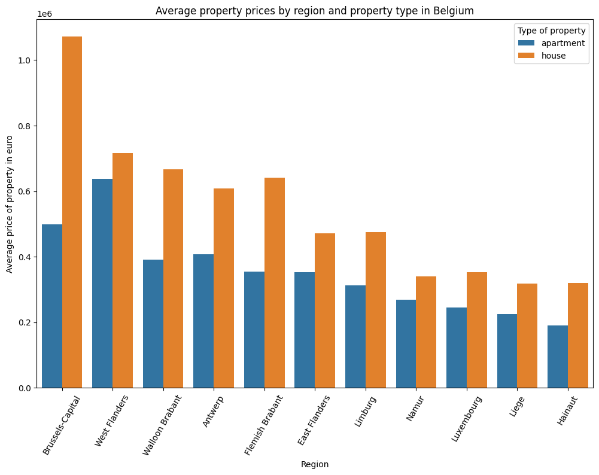
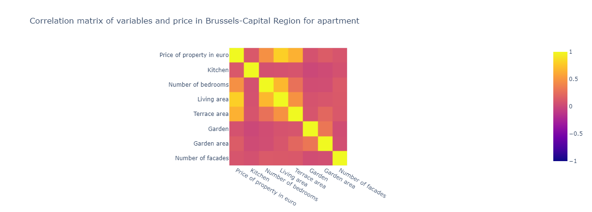

# challenge-data-analysis
This repository is created for the data analysis challenge by ImmoEliza. The aim of this challenge is to analyze a dataset that contains real estate sales data for properties in Belgium. 🏠

## Table of Contents
1. [Description](#description) 📄
2. [Installation](#installation) 💻
3. [Usage](#usage) 🛠️
4. [Visuals](#visuals) 🖼️
5. [Files and Directories](#files) 📂
6. [Contributors](#contributors) 👥
7. [Timeline](#timeline) 🗓️
8. [Personal Situation](#personal_situation) 💡


<a name="description"></a>
## Description

The goal of this project is to provide ImmoEliza with the insights they need to establish themselves as the biggest real estate company in Belgium. By analyzing the data, I aim to answer questions related to the correlation between various variables and the property price, the most and least expensive municipalities in Belgium, and other related questions.

The project involves extensive data cleaning, data analysis using tools such as pandas, matplotlib and seaborn, and presenting the interpreted results using simple words and relevant visuals.

In my opinion the most important variables are:
- Area: This is the total living area of the property in square meters. It seems obvious that this would have a strong influence on the price, as larger properties tend to be more expensive than smaller ones. This variable also has a high correlation with price in the dataset.
- Rooms: This is the number of rooms in the property. This could also affect the price, as more rooms could mean more space, comfort and functionality. This variable also has a moderate correlation with price in the dataset.
- Region: This is the region of Belgium where the property is located. There are three regions in Belgium: Brussels-Capital Region, Flemish Region and Walloon Region. This variable could have an impact on the price, as different regions could have different levels of demand, supply, income, taxes, etc. This variable also shows some variation in price per square meter across regions in the dataset.
- Type: This is the type of property, such as house, apartment, villa, etc. This variable could also influence the price, as different types of properties could have different features, qualities and preferences. This variable also shows some variation in price per square meter across types in the dataset.
- Price


<a name="installation"></a>
## Installation

The project requires Python 3.7+ and the following Python libraries installed:

- NumPy
- Pandas
- matplotlib
- Seaborn
- Plotly

To install any missing dependencies, use pip:

```pip install -r requirements.txt```

<a name="usage"></a>
## Usage

Run each notebook from the terminal or command line:

```ipython notebook <name_of_notebook.ipynb>```

<a name="visuals"></a>
## Visuals

All the visuals can be found in the respective Jupyter notebooks. Ex:




<a name="files"></a>
## Files and Directories

1. `property_data.csv`: This file contains the raw dataset for the project.
2. `subtype_of_property_vs_price.ipynb`: This Jupyter notebook contains a visualization showing the relationship between the price and each subtype of properties.
3. `represent_surface_histogram.ipynb`: This Jupyter notebook contains a histogram representing the number of properties according to their surface.
4. `/matrix_corr`:
    - `matrix_Belgium.ipynb`: This notebook contains a heatmap matrix correlation between price and variables in Belgium.
    - `matrix_Regions.ipynb`: This notebook contains a heatmap matrix correlation between price and variables in every region in Belgium.
5. `/mean_median_meter_price`:
    - `Bel_mean_medium_price.ipynb`: This notebook shows plots for Mean, median, and price per meter for properties in Belgium.
    - `Fla_mean_medium_price.ipynb`: This notebook shows plots for Mean, median, and price per meter for properties in Flanders.
    - `Wal_mean_medium_price.ipynb`: This notebook shows plots for Mean, median, and price per meter for properties in Wallonia.
6. `requirements.txt`: This file lists all of the Python libraries that your system needs to run the notebooks.


<a name="contributors"></a>
## Contributors

[Oleksandr Tsepukh (Junior Data Scientist at BeCode)](https://www.linkedin.com/in/oleksandr-tsepukh-ba4985279)

<a name="timeline"></a>
## Timeline

The challenge was completed in 5 days from (06/07/2023) to (11/07/2023)

<a name="personal_situation"></a>
## Personal Situation

As a student at BeCode in Ghent, this project presented an opportunity to apply and strengthen my data analysis skills. From meticulous data cleaning to strategic data interpretation, every step was a learning experience. Despite the challenges, I successfully utilized Python libraries like pandas, matplotlib, and seaborn to derive meaningful insights from the data. This project was a significant milestone in my data analysis journey, reinforcing my analytical capabilities and passion for the field.

This project is part of the AI Bootcamp at BeCode.org