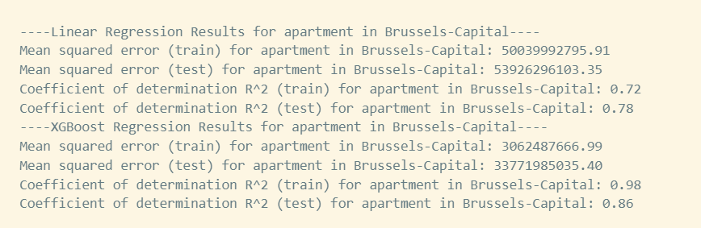

# ImmoEliza Property Analysis and Price Prediction


## Table of Contents
1. [Description](#description) 📄
2. [Installation](#installation) 💻
3. [Usage](#usage) 🛠️
4. [Visuals](#visuals) 🖼️
5. [Files and Directories](#files_and_directories) 📂
6. [API](#api) 🌐
7. [Docker](#docker) 🐳
8. [Contributors](#contributors) 👥
9. [Timeline](#timeline) 🗓️
11. [Personal Situation](#personal_situation) 🛂
12. [Future Improvements/Additions](#futuree) 🔜


<a name="description"></a>
## Description

This repository houses the project for ImmoEliza's data challenge. It focuses on analyzing and predicting property prices in Belgium using a comprehensive real estate dataset. The project utilizes Python libraries for data cleaning, analysis, visualization, and modeling. Additionally, it includes a FastAPI-based API, dockerized for easy deployment, serving property price predictions. 🏠


In my opinion the most important variables are:
- Living area: This is the total living area of the property in square meters. It seems obvious that this would have a strong influence on the price, as larger properties tend to be more expensive than smaller ones. This variable also has a high correlation with price in the dataset.
- Rooms: This is the number of rooms in the property. This could also affect the price, as more rooms could mean more space, comfort and functionality. This variable also has a moderate correlation with price in the dataset.
- Region: There are three regions in Belgium: Brussels-Capital Region, Flemish Region and Walloon Region. This variable could have an impact on the price, as different regions could have different levels of demand, supply, income, taxes, etc. This variable also shows some variation in price per square meter across regions in the dataset.
- Type: This is the type of property, such as house, apartment, villa, etc. This variable could also influence the price, as different types of properties could have different features, qualities and preferences. This variable also shows some variation in price per square meter across types in the dataset.
- Price


<a name="installation"></a>
## Installation

 


The project requires Python 3.7+ and the following Python libraries installed:

- NumPy
- Pandas
- matplotlib
- Seaborn
- Plotly
- Scikit-learn
- FastApi
- etc.

To install any missing dependencies, use pip:

```pip install -r requirements.txt```

To set up the project locally, follow these steps:

1. Clone the repository: `git clone https://github.com/<username>/ImmoEliza-Property-Analysis-and-Prediction.git`
2. Navigate to the project directory: `cd ImmoEliza-Property-Analysis-and-Prediction`
3. Install the dependencies: `pip install -r requirements.txt`
4. Run the FastAPI server: `uvicorn app:app --reload`

The application will be available at `http://localhost:8000`.

<a name="usage"></a>
## Usage

All explanations you can find in ipynb files. Run each notebook from the terminal or command line:

```ipython notebook .\path\<name_of_notebook.ipynb>```

<a name="api"></a>
## API
The API is hosted on Render and is available at the following link (I have a free version and sometimes it needs to be restarted manually):

https://real-estate-prediction-api.onrender.com

It has two routes available:

- GET / - Returns a welcome message
- POST /predict - Accepts a form with the following fields:
    - `type_of_property` (either 'house' or 'apartment')
    - `number_of_bedrooms` (float, must be non-negative)
    - `living_area` (float, must be non-negative)
    - `terrace_area` (float, must be non-negative)
    - `surface_of_land` (float, must be non-negative)
    - `number_of_facades` (float, must be non-negative)
    - `region` (string, must be one of the valid regions)

All fields are mandatory. The data should be sent as form-data.

```On success, it returns a JSON response with the predicted property price:
{
  "prediction price in euro": 450000.0
}
```
In case of an error (missing or invalid data, or server error), it returns an error image message with cats🐈‍⬛ in the following format:

```
{
"detail": An error occurred during prediction: (image). Please try again."
}
```

<a name="docker"></a>
## Docker
The application is also containerized using Docker.

Build the Docker image with:
```
docker build -t <your-image-name> .
```
Run the Docker container with:
```
docker run -p <your-port>:80 <your-image-name>
```

<a name="visuals"></a>
## Visuals

All the visuals can be found in the respective Jupyter notebooks. Ex:





<a name="files_and_directories"></a>
## Files and Directories

1. `/models`:
    - This directory contains the trained machine learning models (in .pickle format) used for the property price prediction. Each property type and region has its own model.
2. `/data`:
    - `property_data.csv`: This file contains the raw dataset for the project. 
3. `/data-exploration`:
    - `Bel_mean_medium_price.ipynb`: This notebook shows plots for Mean, median, and price per meter for properties in Belgium. 
    - `subtype_of_property_vs_price.ipynb`: This Jupyter notebook contains a visualization showing the relationship between the price and each subtype of properties.
    - `Fla_mean_medium_price.ipynb`: This notebook shows plots for Mean, median, and price per meter for properties in Flanders.
    - `Wal_mean_medium_price.ipynb`: This notebook shows plots for Mean, median, and price per meter for properties in Wallonia.  
    - `matrix_Belgium.ipynb`: This notebook contains a heatmap matrix correlation between price and variables in Belgium.
    - `matrix_Regions.ipynb`: This notebook contains a heatmap matrix correlation between price and variables in every region in Belgium.  
    - `represent_surface_histogram.ipynb`: This Jupyter notebook contains a histogram representing the number of properties according to their surface.
4. `/model-building`:
    - `model_building.ipynb`: This notebook contains a complete data analysis pipeline, which involves data preprocessing, training machine learning models, and visualizing the model's performance for predicting property prices across different property types and regions.
5. `/src`:
    - `data_preprocessing.py`: This script handles data loading, cleaning, and preprocessing for property data analysis and model training.
    - `data_visualization.py`: This script shows plots which predicted property prices based on 'Living area' using Linear Regression.
    - `model_training.py`: This script fits, predicts, and evaluates Linear Regression and XGBoost models on property data, handling model training, performance metrics calculation, and data split/scaling.
6. `/output`: This folder contains examples various graphical representations and plots generated from the data analysis, providing visual insights into property prices and model performances.
7. `app.py`: This is the main script that runs the FastAPI application. It includes all the routes and their functionalities.
8. `Dockerfile`: This file contains the necessary commands to build a Docker image for our FastAPI application.
9. `README.md`: Contain all instructions.
10. `requirements.txt`: This file lists all of the Python libraries that your system needs to run the notebooks.

<a name="contributors"></a>
## Contributors

[Oleksandr Tsepukh (Junior Data Scientist at BeCode)](https://www.linkedin.com/in/oleksandr-tsepukh-ba4985279)

<a name="timeline"></a>
## Timeline

The challenge was completed in during working days from (11/07/2023) to (28/07/2023)

<a name="personal_situation"></a>
## Personal Situation

Since the inception of my journey with BeCode's AI Bootcamp in Ghent, I've had the privilege to delve deeper into the intricacies of data analysis, and this project has served as a significant learning curve. It wasn't just about exploring new concepts, but also about effectively applying them to uncover valuable insights.

During the course of this project, I expanded my repertoire of tools by exploring new libraries and APIs. I had the opportunity to work with the ImmoEliza API and JSON files, which broadened my understanding of working with real-time data.

Moreover, I also gained proficiency in advanced data visualization libraries like Plotly beyond the traditional matplotlib and seaborn. This allowed me to present data insights more interactively and visually appealing.

In addition, the project introduced me to the world of machine learning with libraries like scikit-learn and XGBoost. This helped me make more accurate predictions about the real estate prices and understand the importance of tuning models to enhance their performance.

Overall, this project was a step up in my data analytics journey. The learnings from this project have not only strengthened my data analysis skills but also made me more confident to face the increasingly complex data scenarios in the future. I look forward to leveraging these skills and tools in my upcoming projects and challenges.

<a name="futuree"></a>
## Future Improvements/Additions 

- Making more reaserching in region West Flanders to make model fit better🥴
- Encode non-numerical data to numerical with get_dummies or OneHotEncoder in model training part(in data-exploration it works well)
